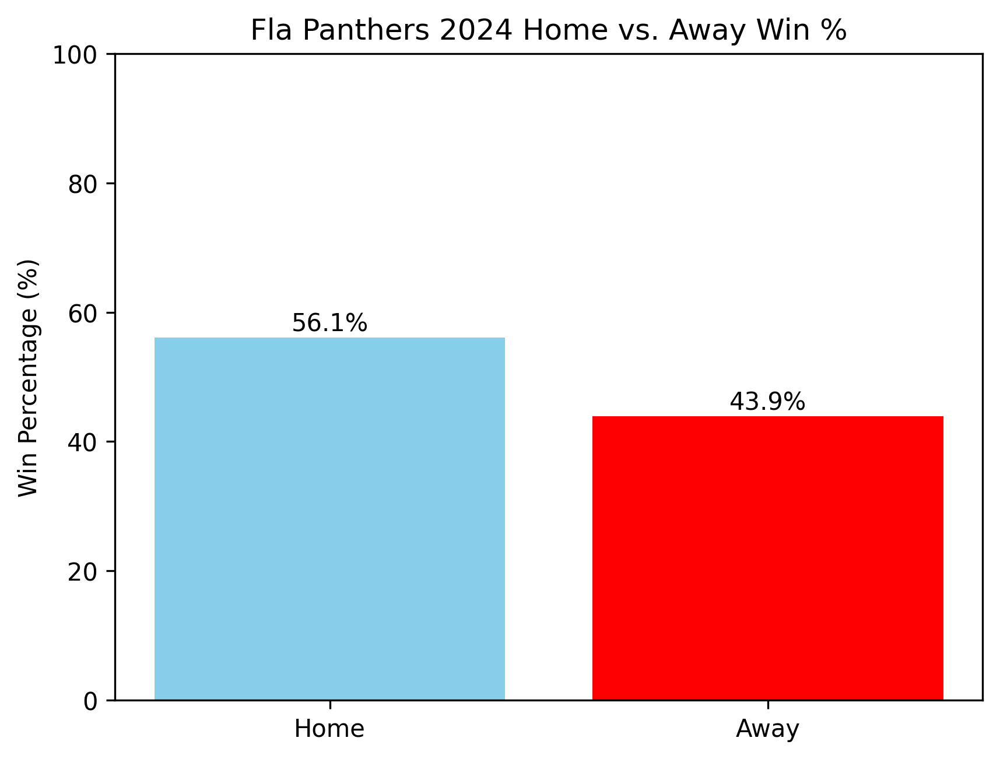

# fla-panthers-2024-win-analysis
A Python analysis of the Florida Panthers’ 2024 home vs. away win percentage

# FLA Panthers 2024 Win % Analysis 🏒

This project analyzes the Florida Panthers' home and away win percentages during their 2024 Stanley Cup–winning season using real NHL data from MoneyPuck.

## What It Does

- Loads and cleans raw game-level data
- Filters for 2024 season and full-game situations
- Calculates home vs. away win %
- Creates a bar chart with color-coded results

## Sample Output

- Home Win %: 56.1%
- Away Win %: 43.9%

## Tools Used

- Python 🐍
- pandas
- matplotlib

## Data Source

[MoneyPuck.com](https://moneypuck.com/) – open hockey analytics data

---

Let me know if you want to expand this project later with playoff stats or more seasons!
